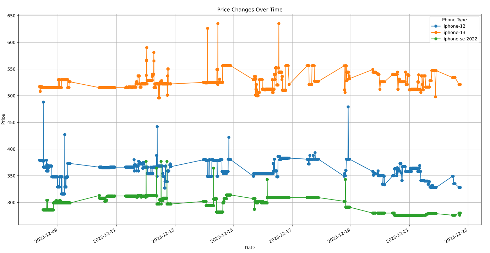
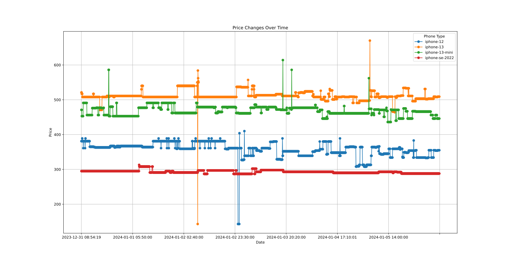

## Motivation
My Iphone 7 has seen better days, thats why I started
to look for a new phone.

I want to stay with an Iphone, mainly due to convenience.

I also like my current setup which is centered around key apps and
using a grayscale filter + a  heavily reduced white point (see [cripple-your-technology](https://matt.might.net/articles/cripple-your-technology/))

Some apps I value:

- anki
- gmaps
- mail
- banking
- fitbit
- shortbreak (movement videos)
- wikipedia
- nextcloud
- whatsapp/signal
- overcast
- brilliant
- org file browsing + flat habits

Thats why I want to stay with an Iphone, although they are of course very pricey.
Luckily, buying refurbed nowadays is a great option, but when I started
looking up some prices there seems to be quite a lot of movement going on.

This likely arises naturally from the market (resellers depend on individuals or
maybe companies to sell the used phones, and the best deals are simply very limited,
or sold out quickly).

In order to determine whats a good price I decided to write a small web scraper
and record some historic prices for the models I am interested in, which are:

- Iphone SE
- Iphone 12
- Iphone 13


## Technical components
The simplest thing I could think of is a python script regularly
scrapes the price of a list of models and saves these in an sqlite file.

In a first version I did just that.

Next, I realized it would be great to also save the parameters of
the current offer, of course cheaper phone usually have a weird color and


## Update: Retrieve actual phone parameters
The problem was that even though I had a price at a specific date,
the exact parameters of the phone were missing. In the refurbished shop
I use they always show you the "best deal", therefore
I simply started to save the entire HTML in the sqlite database also besides
the price, this lets me look up the phone parameters at a later point in time.

The code looks as follows:
```python
# Function to scrape and extract the price from the provided URL
def scrape_price(url):
    response = requests.get(url)
    print(f"Scrapping url {url}, got response {response}")
    soup = BeautifulSoup(response.text, 'html.parser')
    price = # your logic for extracing the price
    return price.strip(), str(soup)

# Function to save data into the SQLite database
def save_to_database(url, price, date, html):
    DB_PATH = '/home/pt/repos/phone-prices/prices.db'
    conn = sqlite3.connect(DB_PATH)
    cursor = conn.cursor()

    # Create a table if it doesn't exist
    cursor.execute("""
        CREATE TABLE IF NOT EXISTS prices (
            id INTEGER PRIMARY KEY AUTOINCREMENT,
            url TEXT,
            price TEXT,
            date TEXT,
            html TEXT,
            notified INTEGER
        )
    """)

    # Insert the scraped data into the database
    notified = 0
    cursor.execute(
        """
        INSERT INTO prices (url, price, date, html, notified)
        VALUES (?, ?, ?, ?, ?)
        """,
        (url, price, date, html, notified))

    # Commit the changes and close the connection
    conn.commit()
    conn.close()

# Main function
def main():
    urls = ## your list of url's
    for url in urls:
        try:
            # Scrape the price
            price, html = scrape_price(url)
            # print(html)

            # Get the current date
            current_date = (datetime.now()
                .strftime('%Y-%m-%d %H:%M:%S'))

            # Save the data into the SQLite database
            save_to_database(url, price, current_date, html)
            time.sleep(3)
        except Exception as e:
            print(e)
            print(f"Failed for {url}")
        else:
            pass
```


## Setting up a systemd timer using NixOs

To almost the most interesting part of this project is 
setting up the scrap job as a systemd timer in my NixOs configuration.
I only recently started using NixOS, and still have a lot to learn.
I really feel the need to dive deeper
into the details and do things the correct way.

Anyway, it is actually straight forward to declaratively define
the systemd timer:


```nix
  systemd.timers."scrape-phone-prices" = {
    wantedBy = [ "timers.target" ];
    timerConfig = {
      OnBootSec = "30m";
      OnUnitActiveSec = "30m";
      Unit = "scrape-phone-prices.service";
    };
  };

  systemd.services."scrape-phone-prices" = {
    wantedBy = [ "multi-user.target" ];
    path = [
      pkgs.nix
      pkgs.bash
      (pkgs.python3.withPackages (ps: with ps; [
        numpy
        requests
        beautifulsoup4
      ]))
    ];
    script = ''
       python3 /home/pt/repos/phone-prices/scrape-phone-prices.py
    '';
    serviceConfig = {
      Type = "oneshot";
      User = "pt";
    };
  };
```


## Recorded Price Data

Now lets take a look at some price data:


I was quite surprised to find such a big price range for each model.
Again to my knowledge the differences in the actual phone are  only optical + color changes,
still we get:


<table border="2" cellspacing="0" cellpadding="6" rules="groups" frame="hsides">


<colgroup>
<col  class="org-left" />

<col  class="org-right" />

<col  class="org-right" />

<col  class="org-right" />
</colgroup>
<thead>
<tr>
<th scope="col" class="org-left">Phone</th>
<th scope="col" class="org-right">Highest</th>
<th scope="col" class="org-right">Lowest</th>
<th scope="col" class="org-right">Difference</th>
</tr>
</thead>

<tbody>
<tr>
<td class="org-left">iphone 13</td>
<td class="org-right">643</td>
<td class="org-right">498</td>
<td class="org-right">145</td>
</tr>


<tr>
<td class="org-left">iphone 12</td>
<td class="org-right">487</td>
<td class="org-right">312</td>
<td class="org-right">175</td>
</tr>


<tr>
<td class="org-left">iphone SE (2022)</td>
<td class="org-right">375</td>
<td class="org-right">281</td>
<td class="org-right">94</td>
</tr>
</tbody>
</table>


## Price Alarms

### Using a telegram bot
I personally do not use telegram, but using bots for automated notifications seems
like a really nice use case for it. 

Started writing a telegram bot which notifies about prices below threshold.

```python
import os
import time
import telebot
import sqlite3

from dotenv import load_dotenv
load_dotenv()

BOT_TOKEN = os.environ.get('BOT_TOKEN')
bot = telebot.TeleBot(BOT_TOKEN)


@bot.message_handler(commands=['start', 'hello'])
def send_welcome(message):
    bot.reply_to(message, "Howdy, will start watching phone prices!")

    while True:
        check_and_notify(message.chat.id)
        time.sleep(60)


def check_and_notify(chat_id):
    thresholds = {
        'iphone-se-2022': 250,
        'iphone-13-mini': 420,
        'iphone-12': 300,
        'iphone-13': 600
    }
    conn = sqlite3.connect('/home/pt/repos/phone-prices/prices.db')
    cursor = conn.cursor()
    cursor.execute("SELECT * FROM prices WHERE notified = 0")
    new_prices = cursor.fetchall()
    for price in new_prices:
        row_id, url, price, date, html, notified = price
        if thresholds[url] >= int(price):
            message_text = """
                New Price Alert!
                Phone: {url.split('/')[4]}
                Price: {price}
                Time: {date}
                Url: {url}"""
            bot.send_message(chat_id, message_text,
                disable_web_page_preview=True)
        cursor.execute("UPDATE prices SET notified = 1 WHERE id = ?",
            (row_id,))
        conn.commit()
        time.sleep(1)

    conn.close()

bot.infinity_polling()
```

## Update: 6.1.2024
I have some new price data to share:




You see that lonely orange dot on the 2.1.2024?
Thats when I managed to "buy" two Iphone 13 for 143€ each.
This of course turned out to be a bug, and no phones were delivered.

The relevant german law is roughly as follows:

> Usually as soon as you buy something in an online store the purchase contract is concluded between you and the online shop,
> but if you yourself did not trust the price to be real
> its not a valid contract, they call this "trust theory".

Which of course applies in my case.


<!-- ## Scraping via Azure Functions -->
<!-- Next I decided to host the scraping on azure: -->

<!-- [scraping-phone-prices-(2)](./2023-12-31-az-phone-prices.html) -->

<!--  LocalWords:  Philipp Theyssen Iphone apps anki gmaps fitbit org
<!--  LocalWords:  shortbreak wikipedia nextcloud whatsapp pricey def
<!--  LocalWords:  refurbed sqlite url BeautifulSoup html extracing
<!--  LocalWords:  str systemd NixOs NixOS wantedBy pkgs ps numpy pt
<!--  LocalWords:  beautifulsoup serviceConfig oneshot img src px col
<!--  LocalWords:  cellspacing cellpadding hsides colgroup thead tr
<!--  LocalWords:  tbody td iphone bot bots os telebot dotenv int
<!--  LocalWords:  fetchall
 -->
